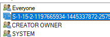
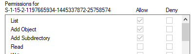

# AppContainer Study note

这是一篇学习 Windows AppContainer的笔记，基本上是搬运[https://github.com/M2Team/M2TeamCommonLibrary](https://github.com/M2Team/M2TeamCommonLibrary)的代码。仅作为个人笔记使用。。。。

## 学习目标

弄清楚代码中的逻辑，并且实现修改AppContainer的权限

### CHAPTER0 CREATE APPCONTAINER SELF
Q:
为什么要大费周章的使用`NtCreateLowBoxToken`？使用`CreateAppContainerProfile`明明已经能够创建AppContainer了。如果说真的是从头开始创建的话，为什么这边又需要一个`AppContainer SID`呢？

Q:
整个创建流程做了些什么呢？

Q: AppContainer的进程的特征在哪儿？具体的进程Token和普通的进程Token的区别是啥？

Q: 如何查看具体的进程Token

### CHAPTER1 LIMIT ACCESS FOR GLOBAL OBJECT
Q:
一个APPContainer进程能够访问的全局对象是有限的？这是怎么回事？

Senario:
> Chrome Beta 78 render 进程

A:
据观察，在创建AppContainer的token的时候，需要调用API
```cpp
NTSTATUS NtCreateLowBoxToken(
    HANDLE * phLowBoxToken, 
    HANDLE hOrgToken, 
    ACCESS_MASK DesiredAccess, 
    OBJECT_ATTRIBUTES * pOa, 
    PSID pAppContainerSid, 
    DWORD capabilityCount, 
    PSID_AND_ATTRIBUTES capabilities, 
    DWORD lowBoxStructHandleCount, 
    PLOWBOX_DATA lowBoxStruct
    );
```
这个API会创建一个`LowBox Token`，这个token 是一个低权限的token，可以作为`primary user token`使用。在`CreateProcessAsUser`的时候可以使用，从而创建一个创建受到限制的进程（也就是APPContainer）。

Q: 不能访问全局的原因找到了，是因为创建Root Directory的时候，没有带有任何安全描述符。创建对象的时候没有安全描述符会发生什么呢？
A: 这个似乎找到答案了。对于通常的进程来说，一个`NULL`的DACL意味着**任意访问权限**，而对于AppContainer进程来说，这就意味着**全部Deny**。换句话说，AppContainer进程中**只有显示定义了Allow的权限才能够被允许执行**。

Q: 那具体是哪个安全描述符导致的问题呢？
目前已近确定了，是`\\Sessions\{sessionID}\AppContainerNamedObjects\{AppContainerSID}`这个对象下的**PACKAGE SID**这个Owner的以下几个权限没有出现  
  
  
当如上带有tick的权限的都没有的时候，可以理解成当前进程，也就是**PACKAGE SID**的token对于`Add Object\list\Add Subdirectory`会没有权限，于是AppContainer的进程就会在打开Object的时候，出现`OpenEvent failed`。
_猜测理由：因为没有`Add Object`的话，可能_


## TODOList

 * [*] BuildAppContainerSecurityDescriptor的完成
 * [*] SetKernelObjectIntegrityLevel的完成
 * [*] NtCreateSymbolicLinkObject的使用（指不创建global link)
 * [*] 对进程中AppContainer SID修改的研究
 * [ ] 跨进程对AppContainer SID修改的研究
 * [ ] 使用`Impersonate`尝试访问Object

